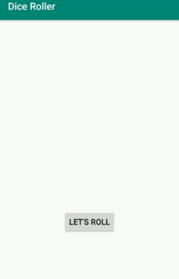

# android_practice

A collection of apps I wrote for the [Developing Android Apps with Kotlin](https://www.udacity.com/course/developing-android-apps-with-kotlin--ud9012) online course  on Udacity.

* [DiceRoller](#DiceRoller): a six-face die which can be rolled by clicking a button
* [AboutMe](#AboutMe): displays configurable text and a scrollable personal bio
* [ColorMyView](#ColorMyView): boxes that change color when clicked or when buttons are pressed
* [ShoppingList](#ShoppingList): an app to add items to a shopping list
* [TriviaGame](#TriviaGame): multiple-choice trivia game

## DiceRoller
A six-face die which can be rolled by clicking a button

Things I did:
* Installed APKs on devices both real and emulated
* Learned about components of an Android app, such as activities, layouts, drawables, string values, Gradle build files and namespaces
* Used `lateinit` to improve performance by avoiding repetitive calls to `findViewById`
* Learned some basics on backward compatibility

## AboutMe
Displays configurable text and a scrollable personal bio

Things I did:
* Learned to use Android Studio's Layout Editor to create views (`TextView`, `ScrollView`, `ImageView`, `EditText`)
* Set view attributes and extracted styles for reusability
* Used data binding to improve performance

## ColorMyView
Boxes that change color when clicked or when buttons are pressed

Things I did:
* Learned to create contraints, ratios, bias, chains and baselines to adapt to different screen configurations

## ShoppingList
An app to add items to a shopping list

Things I did:
* Learned how to build `RecyclerViews`
* Restore state with `onSaveInstanceState()` after configuration changes such as switching to Landscape Mode
* Started second activity and used explicit intents to pass information between activities

## TriviaGame
Multiple-choice trivia game

Things I did:
* Learned about Navigation Graphs, the Navigation Controller and `NavHostFragment`
* Set up navigation graph for conditional navigation between fragments, used `safe-args` dependency (which generates `NavDirections` classes), added enter/exit animations
* Manipulated fragment back stack with inclusive and exclusive forms of `popUpTo`
* Created up button (hooked to navigation) and "About" menu item in action bar
* Created navigation menu (unlocked only in starting fragment)
* Used implicit intents to send data to other apps

